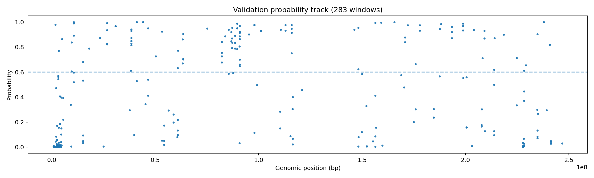
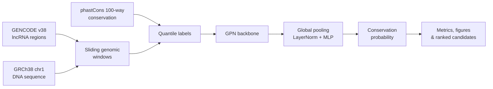
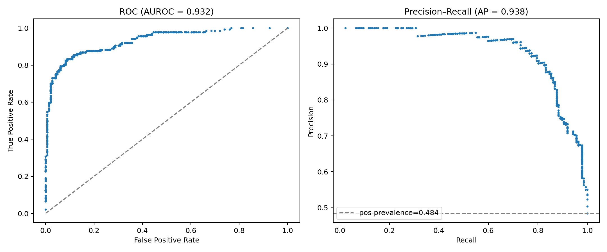
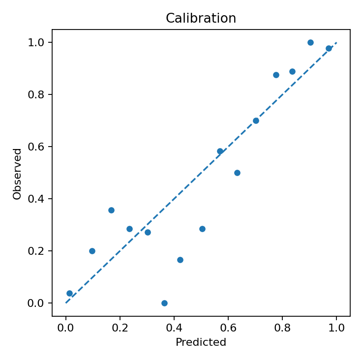
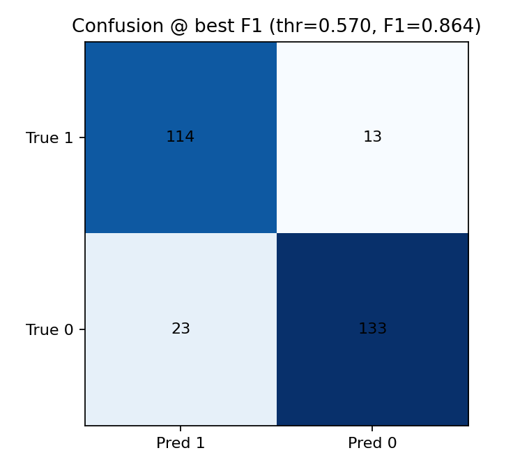
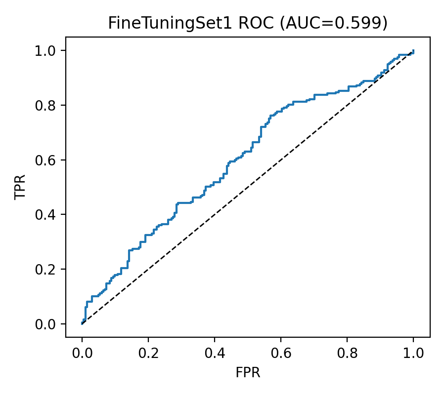
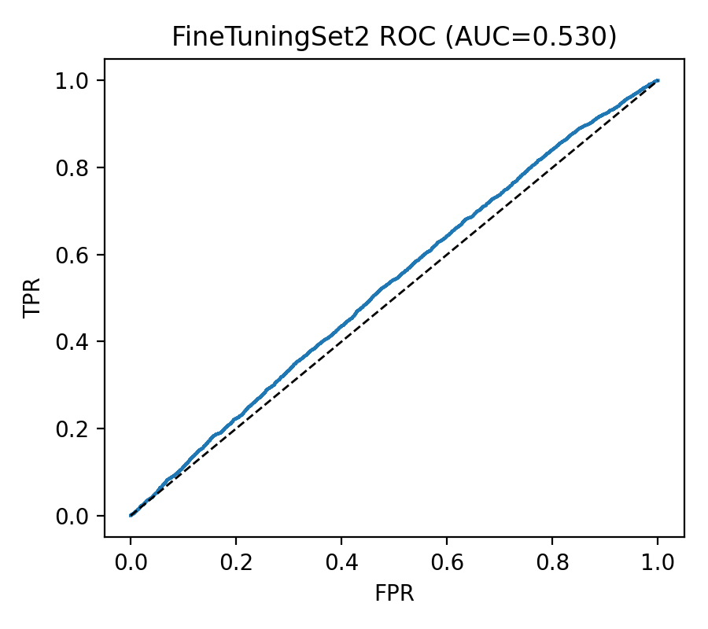

# Deep Mining the Genome's Dark Matter

### A personal research-engineering case study in genomic language modelling

[](https://flandre23333.github.io/genomic-deep-learning-portfolio/)


> **Contribution scope:** This repository presents my independent GPN training, fine-tuning, HPC, and evaluation work from the UNSW COMP3900 team capstone *Deep Mining the Genome's Dark Matter*. The original team repository remains private. Team-owned frontend, backend, GPN-MSA, preprocessing, and UMAP implementations are intentionally excluded.



## Headline results

| Metric | Result | Interpretation |
|---|---:|---|
| AUROC | **0.932** | Strong separation between high- and low-conservation windows |
| AUPRC | **0.938** | High precision–recall performance on the validation task |
| Accuracy | **86.6%** | Accuracy on held-out validation windows |
| Optimisation steps | **2,130** | Recorded steps in the baseline experiment |
| Validation windows | **283** | Genomic windows shown in the chromosome-wide probability track |

## Research question

Much of the human genome does not encode proteins, but non-coding regions can still carry important regulatory and evolutionary signals. This work investigates whether a genomic language model can distinguish **highly conserved** from **weakly conserved** long non-coding RNA (lncRNA) regions on human chromosome 1.

The system combines:

- GENCODE v38 lncRNA annotations;
- the GRCh38 chromosome 1 reference sequence;
- 100-way vertebrate phastCons conservation scores;
- the pretrained [`songlab/gpn-brassicales`](https://huggingface.co/songlab/gpn-brassicales) backbone;
- a custom binary-classification head and training strategy;
- automated evaluation, candidate extraction, and scientific visualisation.

## What I built

### 1. Baseline GPN training engine

I implemented an end-to-end PyTorch training pipeline around the pretrained GPN backbone. It constructs labelled genomic windows, trains a sequence classifier, records experiment metadata, and produces candidate regions and diagnostic figures automatically.

Key capabilities include:

- sliding-window construction from lncRNA annotations and chromosome sequence;
- conservation labels derived from configurable phastCons quantiles;
- balanced high- and low-conservation sampling;
- reverse-complement sequence augmentation;
- AMP mixed-precision GPU training;
- freeze–unfreeze fine-tuning of the classifier head and backbone;
- separate learning rates for the head and pretrained base model;
- configurable window length, stride, thresholds, and chromosome scanning;
- best/final checkpoint saving and run-specific output directories.

### 2. Coordinate-based fine-tuning

I built a second workflow for fine-tuning GPN on curated coordinate-based gene sets. It:

- accepts flexible chromosome/start/end/label input columns;
- creates fixed-length windows inside positive and negative intervals;
- can sample additional background negatives with PyRanges;
- creates reproducible train, validation, and test splits;
- saves the splits as JSONL for inspection and reuse;
- tokenises sequences with the same GPN DNA tokenizer;
- trains with AdamW and optional gradient accumulation;
- evaluates the final model and generates experiment-specific plots.

### 3. HPC experiment orchestration

I authored PBS jobs for the baseline and two fine-tuning experiments on UNSW's Katana HPC cluster. The jobs configure the GPU environment, model cache, dependency path, structured logging, and experiment-specific arguments.

### 4. Automated evaluation

The training pipeline generates complementary views of model quality rather than relying on a single score:

- ROC and precision–recall curves;
- probability calibration;
- score distributions and density plots;
- precision, recall, F1, and accuracy across thresholds;
- best-F1 confusion matrix;
- candidate-region length distribution;
- chromosome-wide probability tracks;
- ranked high- and low-confidence candidate tables.

## System flow



## Data and labelling

### Input sources

| Source | Role |
|---|---|
| GENCODE v38 processed GTF | Defines long non-coding RNA regions |
| GRCh38 chromosome 1 FASTA | Provides the nucleotide sequence for each window |
| hg38 phastCons100way bigWig | Supplies evolutionary conservation scores |

### Baseline task construction

The baseline experiment uses **512 bp windows** with a **128 bp stride**. Mean phastCons scores define the binary target:

- windows below the 30th percentile form the weakly conserved class;
- windows above the 70th percentile form the highly conserved class;
- ambiguous middle-quantile windows are excluded;
- the two classes are sampled at a 1:1 ratio.

This creates a focused classification task while retaining the genomic position of every example for later interpretation.

## Model and training strategy

The classifier uses the pretrained GPN representation with global sequence pooling, LayerNorm, and a compact MLP head. Training starts with the pretrained backbone frozen so the new classifier can stabilise, then unfreezes the full model for lower-learning-rate adaptation.

| Setting | Baseline value |
|---|---:|
| Sequence length | 512 bp |
| Stride | 128 bp |
| Epochs | 30 |
| Frozen-backbone phase | 3 epochs |
| Classifier-head learning rate | 1e-3 |
| Backbone learning rate | 2e-5 |
| Batch size | 16 |
| Weight decay | 1e-2 |
| High/low candidate thresholds | 0.60 / 0.40 |

## Reproducing the experiment

The private source repository contains the original implementation. The following sanitised commands document the experiment interface without exposing university filesystem paths or private data.

### Baseline training

```bash
python train_gpn.py \
  --epochs 30 \
  --seq_len 512 \
  --stride 128 \
  --p_lo 30 --p_hi 70 \
  --eval_every 200 \
  --scan_step 0 \
  --high_thr 0.60 --low_thr 0.40 \
  --topk 200 \
  --amp
```

### Fine-tuning

```bash
python gpn_brass_finetune.py \
  --coords data/FineTuningSet1.txt \
  --outdir runs/gpn_finetune_set1 \
  --fasta data/processed/chr1.fa \
  --seq_len 128 \
  --stride 128 \
  --train_frac 0.80 \
  --val_frac 0.10 \
  --epochs 30 \
  --lr 1e-5 \
  --bsz 16 \
  --ga 1 \
  --phastcons_bw data/hg38.phastCons100way.bw \
  --tag FineTuningSet1
```

### Katana PBS jobs

```bash
# Baseline GPN experiment
qsub gpn_train_hf.pbs

# Coordinate-based fine-tuning experiments
qsub gpn_brass_finetune_set1.pbs
qsub gpn_brass_finetune_set2.pbs
```

## Output contract

Each run writes its own structured output directory:

```text
outputs/run_<id>/
├── epoch_metrics.csv
├── validation_predictions.csv
├── candidate_high.csv
├── candidate_low.csv
├── final_metrics.json
├── ckpts/
│   ├── best.pt
│   └── final.pt
└── figures/
    ├── roc_pr.png
    ├── calibration.png
    ├── confusion_bestF1.png
    ├── genome_track_val.png
    └── ...
```

This layout keeps the training configuration, model states, predictions, candidate rankings, and evaluation figures associated with the same experiment.

## Results gallery

### Baseline discrimination



| Calibration | Best-F1 confusion matrix |
|---|---|
|  |  |

### Fine-tuning comparisons

| Fine-tuning Set 1 | Fine-tuning Set 2 |
|---|---|
|  |  |

## Technical stack

| Area | Tools |
|---|---|
| Modelling | PyTorch, Hugging Face Transformers, GPN |
| Genomics | PyRanges, pyfaidx, pyBigWig, GENCODE, phastCons |
| Evaluation | NumPy, scikit-learn-style metrics, Matplotlib |
| Compute | CUDA, AMP, PBS, Katana HPC |
| Experiment outputs | CSV, JSON, JSONL, PNG, PyTorch checkpoints |

## Authorship and contribution boundary

Final-line attribution was checked against the private repository's `main` branch using the university Git identity associated with this work.

| Component | Final-line attribution | Public presentation |
|---|---:|---|
| GPN baseline training engine | **100%** | Methodology, metrics, and figures included |
| GPN coordinate fine-tuning engine | **99.2%** | Methodology and experiment figures included |
| Fine-tuning PBS jobs | **100%** | Sanitised execution interface included |
| Shared baseline PBS job | 60% | Described, not reproduced verbatim |
| Team frontend/backend | Not my primary contribution | Excluded |
| GPN-MSA and UMAP pipelines | Other team members' work | Excluded |

The public repository contains the portfolio and selected result artifacts. It does **not** copy the private team's Git history, datasets, checkpoints, private paths, or other contributors' source code.

## Research foundations

- Benegas et al., [*Genomic language models: opportunities and challenges*](https://doi.org/10.1073/pnas.2311219120), PNAS.
- [`songlab/gpn-brassicales`](https://huggingface.co/songlab/gpn-brassicales), pretrained GPN model.
- [`songlab-cal/gpn`](https://github.com/songlab-cal/gpn), upstream open-source GPN research code.
- [GENCODE Human Release 38](https://www.gencodegenes.org/human/release_38.html).
- [UCSC phastCons conservation tracks](https://hgdownload.soe.ucsc.edu/goldenPath/hg38/phastCons100way/).

## Portfolio

The interactive version of this case study is available at:

**[flandre23333.github.io/genomic-deep-learning-portfolio](https://flandre23333.github.io/genomic-deep-learning-portfolio/)**
